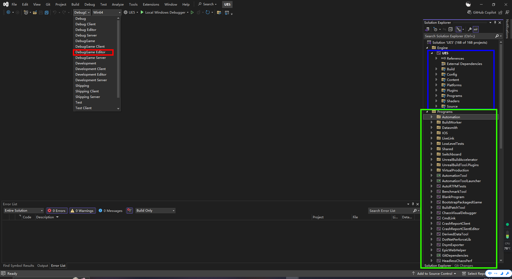
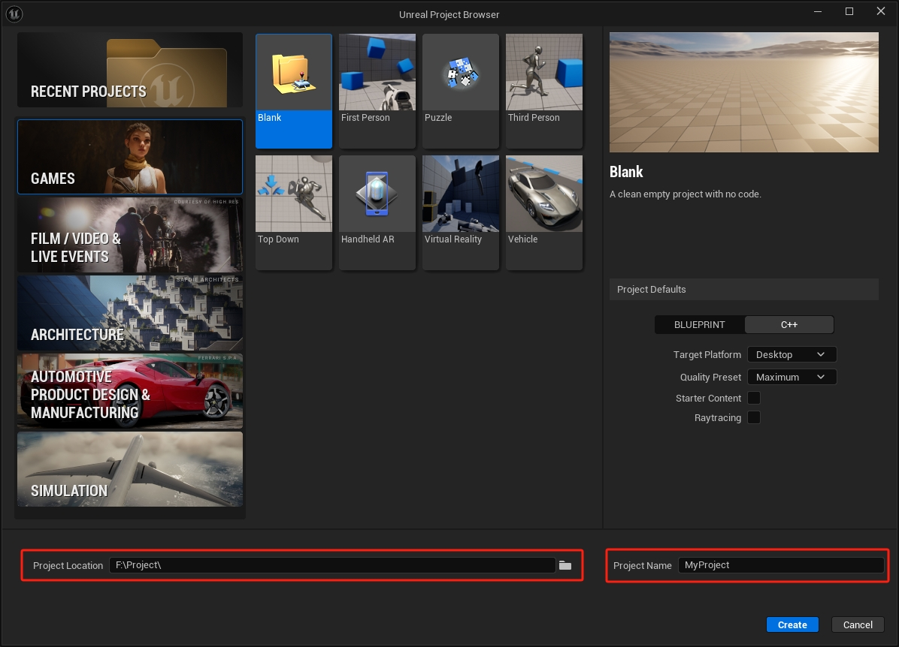
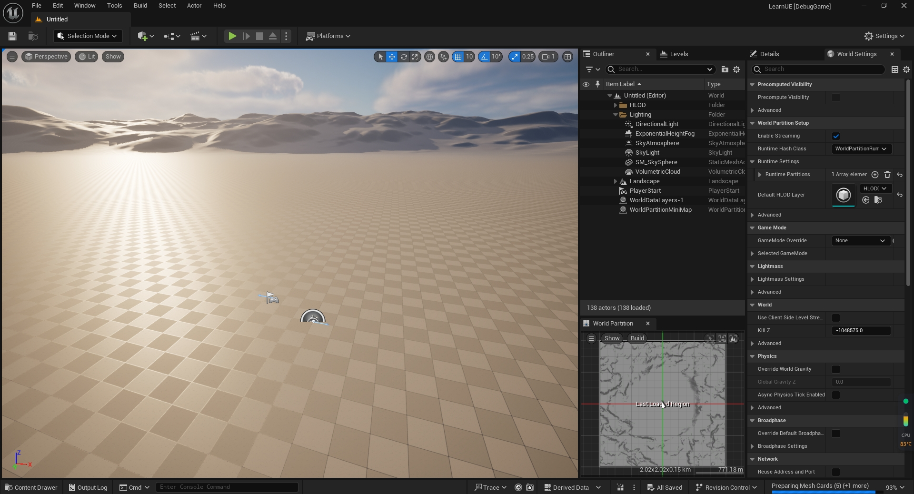

# **UEC++学习记录**

## 环境配置设置

==UE源码可以自行在网络上查找下载因为我这边一进源码版网址就404无法提供下载方式==

Unreal Engine版本：Unreal Engine5.4.4源码版

Visual Studio版本：Visual Studio 2022



调试模式：DebugGame Editor

UE5：UE官方开发的包

Programs：UE官方提供的一些独立程序可提供给开发者自行使用

## UEC++基础(一)

### 创建项目

点击上面的Local Windows Debugger启动UE5



左边的五大块是不同类型的项目创建(游戏、电影/视频&直播活动、建筑、汽车产品设计与制造、模拟)

中间的八小块是八中不同类型的项目案例 (空白、第一人称、拼图、第三人称、俯视角、AR、虚拟现实、赛车)

这里我选择的是Blank空白案例

Project Location：可以自己设置项目存放路径(==不能包含中文路径==)

Project Name：是项目名称(==尽量用英文名称==)



会自动生成并打开打开VS文件


(红色部分是我自己创建的先不用管)

### UnrealBuildTool（UBT）

表示项目环境依赖信息，用到哪些模块（“Core”,“CoreUObject”,“Engine”,“InputCore”，这些是初始内置模块）

```C++
// Copyright Epic Games, Inc. All Rights Reserved.

using UnrealBuildTool;

public class LearnUE : ModuleRules
{
	public LearnUE(ReadOnlyTargetRules Target) : base(Target)
	{
		PCHUsage = PCHUsageMode.UseExplicitOrSharedPCHs;
	
		PublicDependencyModuleNames.AddRange(new string[] { "Core", "CoreUObject", "Engine", "InputCore", "EnhancedInput" });

		PrivateDependencyModuleNames.AddRange(new string[] {  });

		// Uncomment if you are using Slate UI
		// PrivateDependencyModuleNames.AddRange(new string[] { "Slate", "SlateCore" });
		
		// Uncomment if you are using online features
		// PrivateDependencyModuleNames.Add("OnlineSubsystem");

		// To include OnlineSubsystemSteam, add it to the plugins section in your uproject file with the Enabled attribute set to true
	}
}

```


==LearnUE.Build.cs==依赖的模块

==LearnUE.Target.cs==为目标平台设置

### UnrealHeadTool（UHT）

用于收集头文件生成反射信息 头文件发生变化时 UE引擎会调用UHT生成新的反射信息


```c++
#pragma once//表示头文件只会编译一次

#include "CoreMinimal.h"//包含基本的头文件 还有数据类型、宏、函数、接口等头文件
#include "GameFramework/GameMode.h"//包含游戏模式类头文件
#include "YCNGameMode.generated.h"//生成的反射数据头文件
```


### UEC++主要的头文件介绍

==UCLASS()==告知虚幻引擎生成类的反射数据 类必须派生自UObject

==GENERATED_BODY()==表示我们不直接使用父类的构造函数 如果我们要在我们自定义的类中做一些初始化操作 需要我们自己在.h头文件中声明构造函数 然后在.cpp文件中 实现该构造函数 默认它之后的成员函数 成员变量是private

==GENERATED_UCLASS_BODY()==表示我们使用父类的构造 如果我们在自定义的类中做一些初始化操作 可以直接在.cpp文件中实现构造函数 而不需要在.h头文件中去声明 这个宏会自动生成带有特定参数的构造函数 它之后的成员是public

==UPROPERTY()==叫做属性声明宏 虚幻C++在标准基础之上实现了一套反射系统（Reflection System） 反射系统负责垃圾回收 引用更新 编译器集成等一系列高级且有用的功能 而UPROPERTY的作用就是声明该属性在反射系统的行为

==UFUNCTION()==函数声明宏 反射系统可识别的C++函数

==USTRUCT()==结构体声明宏 反射系统可识别的C++结构体UENUM() 枚举声明宏 反射系统可识别的C++枚举

